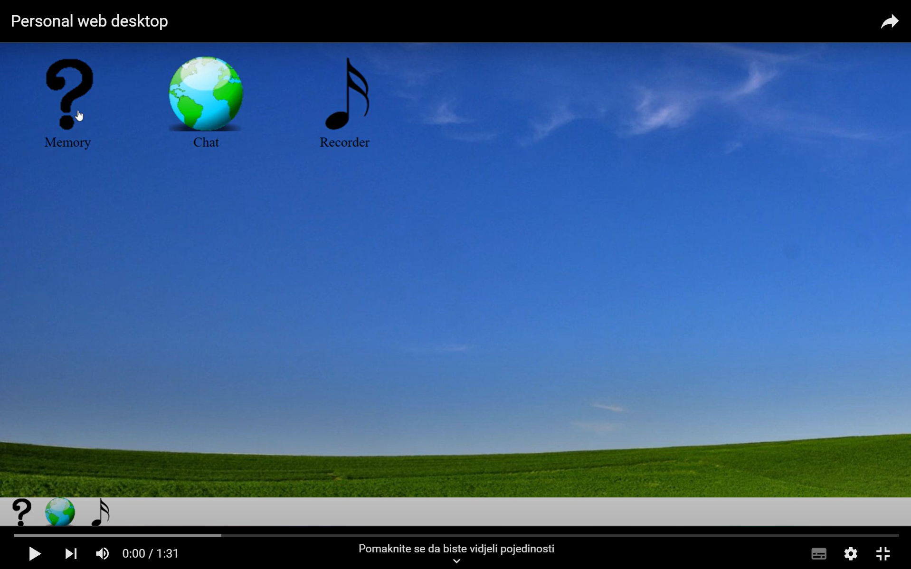

# Personal Web Desktop (PWD)


## Overview
**Personal Web Desktop (PWD)** is a single-page application (SPA) designed to simulate a desktop-like environment within the browser. This application integrates various sub-applications, including a memory game and a messaging app, allowing for a rich and interactive user experience. The app is designed as a Progressive Web Application (PWA), which means it has offline capabilities and behaves like a native app.

## Features

### Main PWD Application
- **Desktop-Like Environment**: The PWD mimics a traditional desktop, complete with draggable windows and a dock that contains icons for all sub-applications.
- **Multiple Instances**: Users can open multiple instances of the same sub-application or different sub-applications simultaneously.
- **Window Management**: Sub-applications are draggable and stackable. The focused application window is always on top.
- **Closeable Windows**: Users can close sub-application windows when they are done using them.
- **Progressive Web Application (PWA)**: The PWD supports offline functionality and can be installed as a PWA on various devices.
- **Custom Feature**: The PWD is extended with at least one additional custom feature.

### Memory Sub-App
- **Classic Memory Game**: A simple memory game where players flip tiles to find matching pairs.

### Messages Sub-App
- **Chat Application**: A WebSocket-based messaging app similar to WhatsApp, Signal, or FB Messenger.
- **Real-Time Communication**: Chat in real-time with other users connected to the course-wide message server.

### Recorder Sub-App
- **Sound Recording**: A simple recorder app where users can record their voice or any sound.
- **Playback Feature**: Users can play back the recorded sound within the app.

## Demo video
[](https://www.youtube.com/watch?v=MDq61kMATHY)

## Installation

To install and run the application locally, follow these steps:

1. Clone the repository:
```
git clone https://your-repository-url.git
cd personal-web-desktop
```

2. Install dependencies:
```
npm install
```

3. Run the application in development mode:
```
npm run dev
```

4. Build the application for production:
```
npm run build
```

5. Lint the code:
```
npm run lint
```

6. Fix linting issues:
```
npm run lint:fix
```

## Contributors
Johan Leitet: johan.leitet@lnu.se
Mats Loock: mats.loock@lnu.se
Vanja Maric: maricvanj@gmail.com